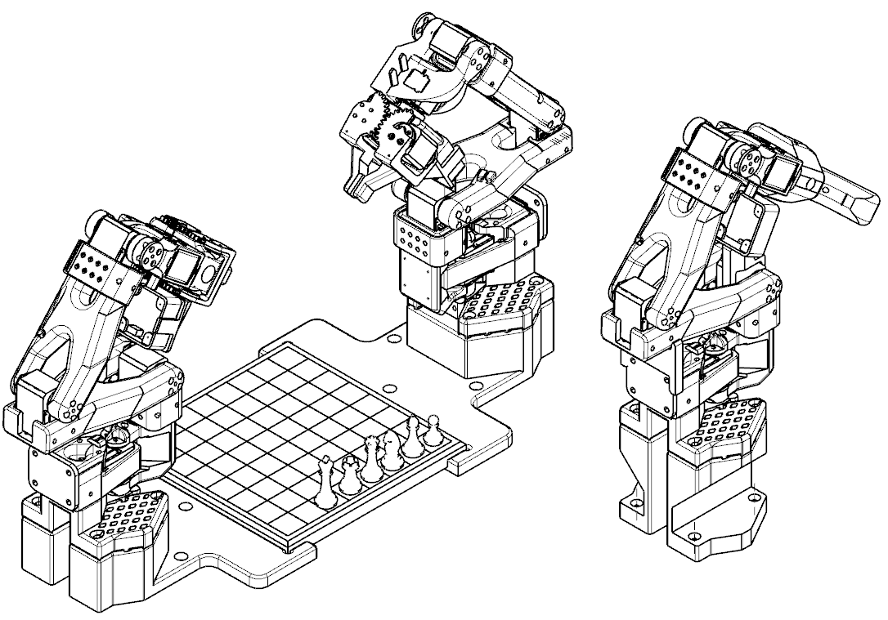

# Cameras
2 of these 120 degree auto focus cameras from aliexpress: https://www.aliexpress.com/item/1005006309455616.html 

# Magnets
Each piece and square of the board is fitted with a magnet. I bought 2 packs of 60 magnets (5.04mm diameter 1.6mm high) from amazon https://www.amazon.com.au/gp/product/B0CM3KX5BC
These are then just press fit into the printed parts - make sure they are around the right way.
