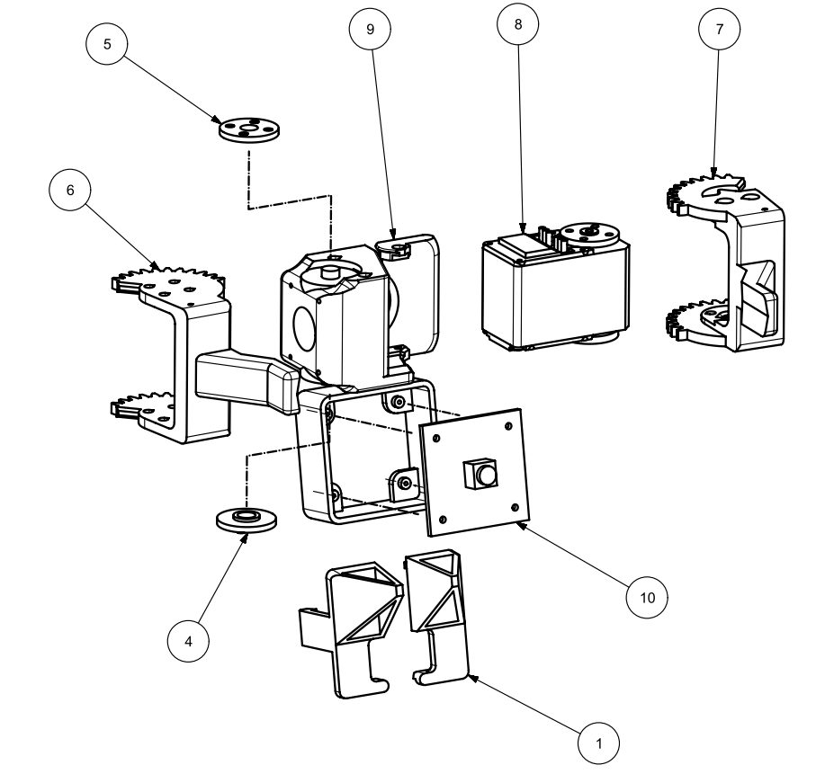

# Cameras
2 of these 120 degree auto focus cameras from aliexpress: https://www.aliexpress.com/item/1005006309455616.html 

# Magnets
Each piece and square of the board is fitted with a magnet. I bought 2 packs of 60 magnets (5.04mm diameter 1.6mm high) from amazon https://www.amazon.com.au/gp/product/B0CM3KX5BC
These are then just press fit into the printed parts - make sure they are around the right way.

# Gripper Assembly
Assemble the new centre closing gripper using the screws provided with the servos. The assembly goes together as shown below:

| Number     | Part Name               |
|------------|-------------------------|
| (not shown)| gripper body            |
| 1          | mirror mount left       |
| 1          | mirror mount right      |
| 4          | idler wheel printed     |
| 5          | idler wheel (from servo)|
| 6          | moving jaw 1            |
| 7          | moving jaw 2            |
| 9          | gripper body with camera|
| 10         | camera (as above)       |

# Mirrors
I used self adhesive plastic mirror "Jindizi 4 Pcs Flexible Mirror Sheets, 15 * 25cm Self-Adhesive Non-Glass Mirror Stickers" from Amazon
